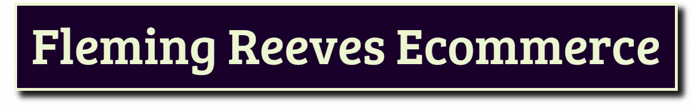

<div id="top"></div>

<!-- PROJECT LOGO -->
<br />
<div align="center">
  <a href="https://github.com/AndrewJFleming/fleming-reeves-ecommerce">
    
  </a>

  <h3 align="center">Fleming Reeves Ecommerce</h3>

  <p align="center">
    A collaborative ecommerce project built with the MERN stack by <a href="https://github.com/AndrewJFleming">Andrew Fleming</a> and <a href="https://github.com/TechnoGecko">Cody Reeves</a> using TypeScript and Redux Toolkit.
    <br />
    <br />
    <a href="https://www.linkedin.com/in/andrew-j-fleming-web-dev">Andrew Fleming LinkedIn</a>
    ·
    <a href="https://www.linkedin.com/in/codingreeves/">Cody Reeves LinkedIn</a>
</div>

<!-- TABLE OF CONTENTS -->
<details>
  <summary>Table of Contents</summary>
  <ol>
    <li>
      <a href="#about-the-project">About The Project</a>
      <ul>
        <li><a href="#built-with">Built With</a></li>
      </ul>
    </li>
    <li>
      <a href="#getting-started">Getting Started</a>
      <ul>
        <li><a href="#prerequisites">Prerequisites</a></li>
        <li><a href="#installation">Installation</a></li>
      </ul>
    </li>
    <li><a href="#usage">Usage</a></li>
    <li><a href="#roadmap">Roadmap</a></li>
    <li><a href="#contact">Contact</a></li>
  </ol>
</details>

<!-- ABOUT THE PROJECT -->

## About The Project

![Project Screenshot][project-screenshot]

This is a collaborative MERN stack project between Andrew Fleming and Cody Reeves. Our primary goal was to gain experience working in a team environment, using the Trello project management software for coordinating tasks for our weekly sprints. The initial release of the app was completed over the course of 4 weeklong sprints (see screenshot below for an example of our Trello board).

![Project Screenshot2][project-screenshot2]

Though both of us had experience with the Material UI CSS framework, a secondary goal for this collaborative project was to improve our skills working with the Material UI components; the styled-components feature as well as the custom theme feature.

![Project Screenshot3][project-screenshot3]

Just like with Material UI, both of us had significant experience working with Redux prior to the start of this project but were eager to gain experience with Redux Toolkit (a more modern way of using Redux).

Finally, we also wanted to gain experience building a React.js project using Typescript; to more easily 'hit the ground running' when potentially working with tech firms where TypeScript is typically used.

<p align="right">(<a href="#top">back to top</a>)</p>

### Built With

- [MongoDB](https://www.mongodb.com/)
- [Express.js](https://expressjs.com/)
- [React.js](https://reactjs.org/)
- [Node.js](https://nodejs.org/)
- [TypeScript](https://www.typescriptlang.org/)
- [Redux](https://redux.js.org/)
- [Redux Toolkit](https://redux-toolkit.js.org/)
- [JsonWebToken](https://jwt.io/)
- [bcrypt](https://www.npmjs.com/package/bcrypt)
- [MaterialUI](https://mui.com/)

<p align="right">(<a href="#top">back to top</a>)</p>

<!-- GETTING STARTED -->

## Getting Started

Below you'll find some instructions on what you'll need to run the project locally on your machine, how to install the app and how to get the app running.

### Prerequisites

- yarn
  ```sh
  npm install --global yarn
  ```
- TypeScript
  ```sh
  npm install -g typescript
  ```

### Installation

Before you run the admin or client Embossed apps locally, you'll need to install their required dependencies.

1. Clone the repo

   ```sh
   git clone https://github.com/your_username_/Project-Name.git
   ```

2. Navigate to the desired directory.

   ```sh
   cd client
   ```

   or

   ```sh
   cd admin
   ```

   or

   ```sh
   cd server
   ```

3. Install NPM packages for each directory.

   ```sh
   yarn
   ```

4. Rename the .env.example file in the client and server directories to .env

<p align="right">(<a href="#top">back to top</a>)</p>

<!-- USAGE EXAMPLES -->

## Usage

The client uses the Node.js server to interact with this project's MongoDB database.

1. Start the client or admin app locally.

   ```sh
   npm start
   ```

2. Navigate to the the server directory and start the server with the same command.
   ```sh
   yarn run start
   ```

<p align="right">(<a href="#top">back to top</a>)</p>

<!-- ROADMAP -->

## Roadmap

- [ ] Use useMemo or useCallback for performance optimization.
- [ ] Add product variants.
- [ ] Add product categories.
- [ ] Add Stripe payment processing to cart checkout.

<p align="right">(<a href="#top">back to top</a>)</p>

<!-- CONTACT -->

## Contact

Andrew Fleming - [LinkedIn](https://www.linkedin.com/in/andrew-j-fleming-web-dev) - [Github](https://github.com/AndrewJFleming) - aflemi1@gmail.com

Cody Reeves - [LinkedIn](https://www.linkedin.com/in/codingreeves/) - [Github](https://github.com/TechnoGecko) - cody.reeves@codingreeves.com

<p align="right">(<a href="#top">back to top</a>)</p>

[project-screenshot]: client/src/assets/images/screenshot.png
[project-screenshot2]: client/src/assets/images/screenshot2.png
[project-screenshot3]: client/src/assets/images/screenshot3.png
